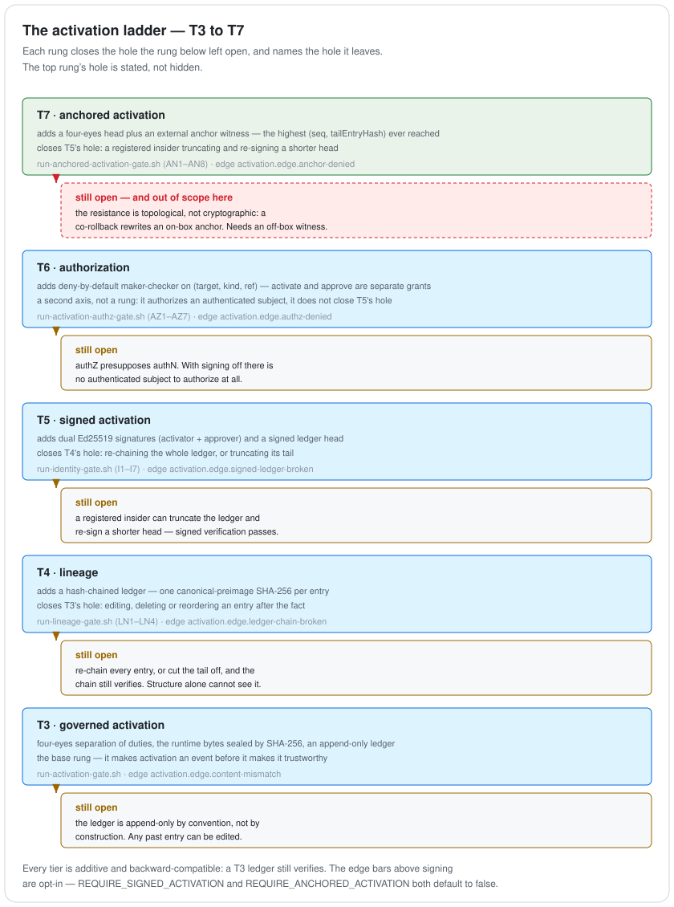

# Bifrost

[](https://github.com/yggdrasil-iiot/bifrost/actions/workflows/ci.yml)


[](LICENSE)

**The governance core of the [Yggdrasil](https://github.com/yggdrasil-iiot) IIoT spine — the "IAM" for the OT governance boundary.**

Bifrost decides *what is allowed to cross the OT/IT boundary*. Nothing — no equipment model, no process spec, no runtime command, no version activation — reaches the plant floor or the unified namespace except as a **governed, fail-closed, provenance-verified contract**. Governance is enforced twice: **pre-deploy** (a CLI gate that rejects a bad change before it merges) and **at the runtime edge** (Heimdall, which refuses a bad command or a bad activation at the OPC-UA write boundary).

**Start here.** Four things this repo is arguing, in the order they are worth checking:

| | |
|---|---|
| **[docs/INTEGRATION.md](docs/INTEGRATION.md)** | Where the systems you already run — MES, SCADA, historian, Kepware, the OT firewall — meet this, wire by wire: every boundary, its protocol, who initiates, and the actual Sparkplug topics. It answers the containment question ("does this sit above or below my MES?") by showing that it sits neither. |
| **[docs/ENTERPRISE.md](docs/ENTERPRISE.md)** | Thirteen axes of taking this to an enterprise, each marked *built · deferred · open · measured*. A **built** row names the gate that proves it; a **deferred** row names the trigger that would force it. Ledger growth, verification cost and audit-at-scale are measured — and the measurements that came out unusable are reported as failures rather than quietly dropped. |
| **[docs/ADOPTION.md](docs/ADOPTION.md)** | The order any of this could go into a plant that is **already running** — six phases, each with an exit criterion and an abort criterion, and the phase where it stops being risk-free. Derived from the code's constraints rather than from experience, and it says so. |
| **[Executable gates](#executable-gates)** | Every claim below is backed by a gate you can run, not by a unit test. All 23 last ran green on **2026-09-10** (Docker 26.1.4), with no leg skipped. |

## What it governs

Two independent governed models, with distinct owners and lifecycles:

| Model | Answers | Artifact | Gate |
|---|---|---|---|
| **Equipment** | *what exists* — the type of a piece of equipment | `UdtDefinition` (AAS-aligned, SemVer'd) | `gates schema` — compatibility (rejects breaking changes) |
| **Process spec** | *how it must run* — admissible ranges, recipes, setpoints | `MasterSpec` + `ConformancePolicy` | `gates spec` / `gates template` — conformance |

Bifrost is the **registry-of-record**: it admits, versions, seals, and activates. Sibling apps only *propose* (Mímir derives models) or *consume* (Muninn feeds the UNS); Bifrost remains the authority, and the apps share **zero code** — they compose only through the governed data/wire contract.

## The gate CLI (pre-deploy, fail-closed)

One `gates` jar, deny-by-default, exit `0` admit / `1` governance-refuse / `2` usage:

| Subcommand | Governs |
|---|---|
| `schema` | UDT schema compatibility (FORWARD/BACKWARD/FULL, Confluent vocabulary) |
| `spec` | `MasterSpec` conformance against the governed `ConformancePolicy` |
| `template` · `adapt-template` | **site ⊨ enterprise** prescriptive governance; a ports-&-adapters core proven standard-agnostic (Ignition / CFIHOS / AAS adapt ≡ native) |
| `policy` | deny-by-default NCMD command authorization (also as an OPA/Rego policy evaluated in-JVM via WebAssembly) |
| `provenance` | git-anchored SHA-256 manifest for the recipe store |
| `activate` · `active` · `activation-log` | the governed **activation** lifecycle (below) |
| `activation verify-chain` | T4 — tamper-evidence of the activation ledger |
| `identity keygen` · `identity verify-signed` | T5 — cryptographic identity over activations |
| `identity authorize` | T6 — deny-by-default authorization: who may activate/approve a resource |
| `identity verify-anchored` | T7 — external-anchor cross-check + four-eyes head (rollback-evident) |
| `identity rotate-key` | rotate a signing key **without breaking history** — the predecessor keeps verifying what it signed and stops signing anything new |
| `activation duty-key-mint` | mint a **break-glass** duty key: two registered people, ahead of the emergency |
| `acl-project` · `command-log` | the broker ACL a command policy implies · the edge's chained record of commands |
| `model-reconcile` | the **vendor's copy** of a governed model against the registry — divergence named per member |
| `conduit-project` | the governed conduits as the `CommunicationPolicy` **Huginn** reads |
| `federation audit` | multi-site — aggregates per-site activation ledgers into one cross-site view of what is active where |

## The governed activation lifecycle

"Which version is live at an edge" is itself a **governed event** — and the record of those events is progressively hardened from an audit trail into an authenticated, non-repudiable history:

<picture>
  <source media="(prefers-color-scheme: dark)" srcset="docs/diagrams/activation-ladder.dark.svg">
  
</picture>

Each rung closes the hole the rung below left open, and names the hole it leaves. The top rung's hole is stated rather than hidden, and T6 is marked as what it is — a second axis, not a rung.

- **Governed activation (T3)** — activation requires **four-eyes SoD** (a distinct approver), seals the **exact runtime bytes** by SHA-256, appends to an audit ledger, and supports guarded rollback. Heimdall **binds the ledger's active version** at startup and re-checks the content hash at the edge (verify-then-trust).
- **Lineage / record-of-record (T4)** — the ledger is **hash-chained** (`LedgerChain`, one canonical-preimage SHA-256 per entry), so any retroactive edit / delete / reorder / mid-truncation is detectable from the ledger alone. Heimdall **fail-closes on a broken chain** before binding.
- **Identity / signed activation (T5)** — each activation is **dual-signed** (activator + approver Ed25519, JDK built-in) and the ledger tail is anchored by a **signed head**, closing the full-re-chain and tail-truncation gaps a bare hash chain leaves open. Signatures cover T4's `entryHash`, so structural verification is untouched and unsigned ledgers stay valid. Heimdall's `REQUIRE_SIGNED_ACTIVATION` (default off) fail-closes on a broken *signed* ledger.
- **Authorization (T6)** — a **deny-by-default** policy (`registry/identity/activation-policy.json`) decides *whether the authenticated principal is permitted*: **maker-checker**, where the activator needs an `activate` grant and the approver an `approve` grant on the same `(target, kind, ref)` — pairing 1:1 with T5's dual signature. Enforced at the gate and re-verified at the edge (revocation takes effect at the next bind). This is authN (T5) → authZ (T6): the IAM story.
- **Anchored activation (T7)** — the last gap T5's *singly-signed* head leaves open is **rollback by a registered insider**: truncate the ledger, re-sign a shorter head, and signed-verification passes. T7 closes it with two additions. The head becomes **four-eyes** (a second distinct registered co-signer over the same preimage), and the tail is cross-checked against an **external anchor witness** — the highest `(seq, tailEntryHash)` the ledger ever reached — through a pluggable `AnchorStore` seam. The default `FileAnchorStore` is an append-only on-box projection (it catches a *lone* re-anchor: the witness still records the higher `seq`); the opt-in `GitAnchorStore` reads the anchor from **committed git history** (`git show HEAD:<file>`, never the working tree), so a witness committed to a protected remote survives even a **co-rollback** that also rewrites the on-box anchor. Heimdall's `REQUIRE_ANCHORED_ACTIVATION` (default off, with `ANCHOR_STORE`/`ANCHOR_DIR`) raises the edge bar to this tier and fail-closes `activation.edge.anchor-denied` on a rollback / behind / four-eyes-missing fault before binding.

**Break-glass — four-eyes moved earlier in time, not removed.** Four-eyes is what the ladder buys; at 03:00 with one person on site it is also what stops the line from coming back. So two registered people mint a **duty key** *ahead of* the emergency (`gates activation duty-key-mint`), after which one person can activate alone by signing with their own key **plus** the duty key. The marking is **derived from policy, never claimed**: a duty principal is granted `break_glass_approve` and never `approve`, and a policy giving one principal both over overlapping resources is refused at load — so there is no unmarked activation to produce. Nothing in the ledger format changed; to the verifier this is an ordinary two-signature, two-principal, two-key entry, which is why every tier still verifies and the edge still binds (`run-break-glass-gate.sh` B1–B9).

**Key rotation — the predecessor keeps verifying what it signed.** A principal may hold several registered keys. Verification asks *which of them signed this entry* and is deliberately **not** time-filtered: an entry carries no key id and its timestamp is self-asserted, so no honest filter exists. The validity window restricts **signing** instead, which is what makes retiring a key safe — and what gives "retire by policy, never by deleting the key line" a mechanism (`gates identity rotate-key`, `run-key-rotation-gate.sh` K1–K10). **Rotation is not revocation**: a retired key still authenticates its own past.

Each step is additive and backward-compatible — a T3/T4 ledger still verifies, turning on signing does not rewrite history, authZ is enforced only over an authenticated (signed) subject, and anchoring layers strictly above the signed check (`ANCHORED` ⊃ `SIGNED`).

## Heimdall — the runtime edge

`heimdall` is the write-boundary authorizer (a Sparkplug **NCMD** → OPC-UA bridge). Deny-by-default, it independently re-authorizes every command *at the edge* — without trusting any upstream authorization — enforcing command ACLs, conformance bounds, and the governed active version, and fails closed on any uncertainty (bad quality, broken/unsigned ledger, content mismatch, rogue command). It closes the loop the gate opens: *observe → command → observe*.

It also **records what it did**: with `COMMAND_LEDGER_PATH` the edge writes a chained *intent* entry before the applier touches the plant and an *outcome* entry after, and with `REQUIRE_SIGNED_COMMAND` every command must carry a verified requester whose principal the rule then enforces. And it knows its own **certificate lifetime** — days remaining on every boot, a warning window before expiry, `cert_days_remaining` on `/healthz` — because a lapsed transport credential should be diagnosed rather than surface as an opaque connect failure.

For introducing it at a **running** plant there is `ENFORCEMENT_LOG_ONLY`: the edge reaches every verdict and refuses nothing, logging what it would have denied. Enforcement then arrives by removing allowlist rules one reviewable diff at a time rather than by flipping a switch on a live line. Off by default, reversible by a restart, and proven end-to-end by `run-ncmd-runtime-gate.sh` T4/T5 — see **[docs/ADOPTION.md](docs/ADOPTION.md)** for where it sits in a rollout, and the limitations below for what it does *not* cover.

## Federation — one authority, many sites

Single-line governance is not enterprise governance, so the same primitives recombine into a
multi-site topology: an **enterprise git registry** (the authority) plus a **separate enterprise
anchor repository**, with per-site mirror clones that run local-first. Identity trust
(`authorized-keys`, `activation-policy`) federates **down** with the mirror; each site keeps its
**own** activation ledger and anchors it **up** to the enterprise anchor.

`run-federation-gate.sh` proves six properties on two sites:

| | Property |
|---|---|
| F1 | the enterprise template governs both sites — a conforming site specialization passes `site ⊨ enterprise`, a non-conforming one is rejected (exit 1) |
| F2 | governance propagates by `git pull` and takes effect at that site's **next Heimdall restart** (Heimdall reads policy, conformance, ledger and anchor once, at start) |
| F3 | each site activates and enforces independently, and denies a rogue command on its own |
| F4 | a site keeps serving while offline, then reconciles on reconnect |
| F5 | **cross-domain rollback is evident** — a site insider who co-rolls-back the local ledger, head *and* anchor is still caught, because the enterprise anchor is a different trust domain and witnesses the higher `seq` |
| F6 | `federation audit` aggregates both sites' ledgers into one cross-site view of what is active where |

F1/F5/F6 are pure CLI and always run; F2/F3/F4 need Docker and can be skipped.

**Honest, and the gate says so itself:** F5's "cannot rewrite" is **topological**, not
cryptographic. It holds because the enterprise anchor lives in a repository the site never
rewrites. Real closure still needs a genuinely tamper-resistant off-box witness, exactly as in T7.

## Executable gates

Governance is demonstrated end-to-end, not asserted. Pure-CLI gates need no broker; edge gates need
Docker (HiveMQ CE) + host port 1883 and start/stop the container themselves. A gate exits `0` or it
does not pass — there is no partial credit, and a skipped Docker leg is visible in its own output.

```bash
scripts/run-schema-gate.sh                 # schema compatibility admit/reject
scripts/run-spec-gate.sh                   # MasterSpec conformance
scripts/run-template-conformance-gate.sh   # site ⊨ enterprise + 3-adapter equivalence
scripts/run-composable-conformance-gate.sh # ONE ConformancePolicy at design-time AND runtime
scripts/run-provenance-gate.sh             # git-anchored provenance manifest
scripts/run-command-authz-gate.sh          # deny-by-default NCMD authorization
scripts/run-ncmd-runtime-gate.sh           # Heimdall edge authz over a live broker (+ log-only rollout mode, T4/T5)
scripts/run-edge-resilience-gate.sh        # edge survives broker/OPC-UA loss, boots without a plant, announces its own death
scripts/run-write-exclusivity-gate.sh      # the edge presents an X.509 identity; a second client's write is refused by the server
scripts/run-command-identity-gate.sh       # a command carries a verified requester; the rule's principal is enforced
scripts/run-command-ledger-gate.sh         # commands leave a chained record: intent before the plant is touched, outcome after
scripts/run-activation-gate.sh             # T3 — four-eyes SoD, content seal, rollback, edge bind
scripts/run-lineage-gate.sh                # T4 — tamper-evident hash chain, edge fail-close
scripts/run-identity-gate.sh               # T5 — dual-signed activation, signed head, edge fail-close
scripts/run-activation-authz-gate.sh       # T6 — deny-by-default authZ, maker-checker, edge revocation
scripts/run-anchored-activation-gate.sh    # T7 — four-eyes head + external anchor, rollback/co-rollback caught
scripts/run-break-glass-gate.sh            # break-glass — four-eyes moved to mint time; marked, verifiable, edge still binds
scripts/run-key-rotation-gate.sh           # a signing key rotates without breaking history; an expiring certificate is announced
scripts/run-model-reconciliation-gate.sh   # the vendor's copy of a model against the governed one; divergence named per member
scripts/run-huginn-seam-gate.sh            # a write to governed equipment that is not the edge, found by running the real Huginn
scripts/run-federation-gate.sh             # multi-site — enterprise template + cross-domain anchor + federated audit
scripts/run-yggdrasil-spine-gate.sh        # Mímir → Bifrost → Muninn northbound spine
scripts/run-yggdrasil-full-loop-gate.sh    # closed loop: observe → command → observe
```

## Modules

```
core/      the governed model + evaluators — schema, spec/conformance, acl (+OPA-in-wasm),
           template, provenance, activation (T3/T4/T5 identity, T7 anchor), the command ledger,
           vendor reconciliation and the conduit projection. Pure logic, no broker.
gates/     the pre-deploy CLI over core (the `gates` jar).
heimdall/  the runtime edge — NCMD authorization + activation binding, fail-closed.
sim/       an embedded Eclipse Milo OPC-UA server the gates drive end-to-end.
```

## Build & test

```bash
mvn install     # Java 17 · 601 tests (core 326 · heimdall 121 · gates 131 · sim 23)
                # also writes target/bifrost-sbom.{json,xml} — one CycloneDX 1.6 SBOM
                # for the whole reactor (40 components, licences resolved)
```

## Honest scope & limitations

This is a systems-architecture reference implementation; it records its limits rather than hiding
them. The list below is the short form — the long form, with what would force each item, is
[docs/ENTERPRISE.md](docs/ENTERPRISE.md).

- **Authorization is direct principal grants, not roles/attributes (T6).** The policy names each principal explicitly (deny-by-default, maker-checker); RBAC roles and ABAC attributes are future threads, and the policy file is plaintext (bootstrap/change-control out-of-band, no policy-signing yet). authZ presupposes authN — with signing off there is no authorization, because there is no authenticated subject to authorize. Revocation is bind-fresh (a running edge re-checks at the next startup).
- **Anchoring is only as strong as the anchor's off-box protection (T7).** The four-eyes head plus external witness make rollback *evident*, but a `FileAnchorStore` is a local projection that a co-rollback can rewrite in place — it defends the lone re-anchor, not the co-rollback. Real rollback-resistance rests on the witness being genuinely tamper-resistant off-box (a protected git remote / signed tag / TPM monotonic counter); the `GitAnchorStore` demonstrates the seam but a locally-committed anchor repo is still on-box. If the git anchor dir resolves *inside* the registry, both the gate and Heimdall **WARN loudly** — a co-located witness is rolled back with the tree it is meant to witness, so `ANCHOR_DIR` must point at a separate off-box repo to actually close the co-rollback. Anchoring presupposes signing (`ANCHORED` ⊃ `SIGNED`), so it does nothing with signing off.
- **Enforcement can be switched off, and that is a supported mode.** `ENFORCEMENT_LOG_ONLY` (default off) makes the edge evaluate every command and refuse none — what would have been denied is logged `[BRIDGE] LOG-ONLY would-deny` and applied anyway. It exists so an edge can be introduced at a running plant without being able to stop the line on day one ([docs/ADOPTION.md](docs/ADOPTION.md) phase 4), and the startup line `[BRIDGE] enforcement = …` prints in both states so the mode is always readable from the log. It does **not** shadow the malformed-payload rejection or the startup ledger-trust checks: a bridge that cannot trust the model it checks against fails to start rather than waving traffic past. Any deployment left in this mode is not enforcing anything.
- **The trust anchor is a plaintext registry file** (`authorized-keys.jsonl`); key bootstrap and distribution are out-of-band (no PKI/OIDC/CRL). **Rotation exists; revocation does not, and the two are easy to conflate.** `identity rotate-key` retires a key by stamping `notAfter`, which stops it signing anything new — it goes on authenticating everything it already signed, deliberately, because an entry carries no key id and its timestamp is self-asserted. Anyone reading "we rotated that key" as "that key can no longer hurt us" is wrong; invalidating past signatures needs a time source OT sites frequently lack. Certificate renewal is likewise manual and self-signed: the successor thumbprint changes and must reach the server out of band, **before** the edge restarts.
- **The vendor comparison is built; the fetch is not.** `gates model-reconcile` compares a vendor's exported model against the governed definition and names divergence per member, with the port carrying **granularity** so a blob product is recorded as weaker than a per-object one. But nothing connects to a running Kepware, Ignition or ThingWorx — the export arrives as a **file** somebody hands over — and the **projection direction does not exist at all**: nothing generates or pushes a vendor configuration. A finding also proves only that the two copies *disagree*, not which is right.
- **The Huginn seam is an artifact handed across, and the surface mismatch was routed around rather than closed.** `gates conduit-project` emits the governed conduits as the `CommunicationPolicy` Huginn reads, and `run-huginn-seam-gate.sh` runs the real Huginn to prove a write to governed equipment from anything that is not the edge is reported. **Neither repository references the other**; the two tools share no protocol. Three limits travel with it: the equipment-to-address binding is **declared, not discovered**; the projection is a **fragment** that says who may write and not who may read, so alone it flags every legitimate historian; and **visibility is not enforcement** — a bypass acquires an owner, not a block.
- **Conformance egress is structural + range**, and the activation seal binds the runtime `MasterSpec`, not the git-anchored recipe manifest (that unification is future work).
- **Demo scale** — single broker, single edge, single instance, localhost; the sim's transfer is instant setpoint = PV (a governance loop, not process physics). **The federation gate is no exception: it stands both "sites" up on one machine.** It proves the multi-site *topology*, not multi-site operation.
- Parts were developed with AI assistance; all designs and gate results were verified against live services by the author.

## License

[Apache-2.0](LICENSE)
