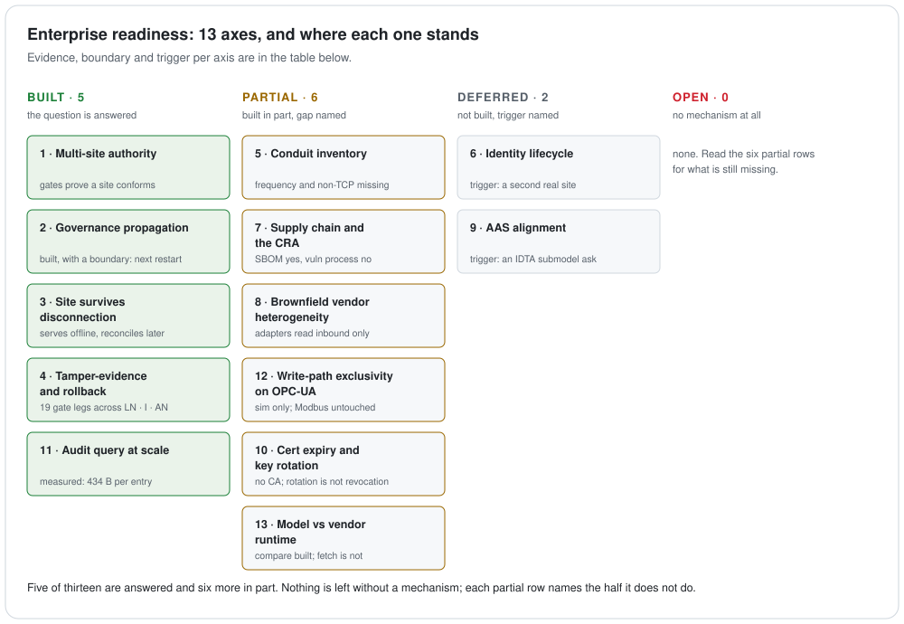

# Taking this to an enterprise

Bifrost is a reference implementation that runs on one machine. This document is about the
distance between that and a real deployment: **which scale problems are already answered, which
are deliberately deferred, and which are open** — for the Yggdrasil spine as a whole
(Bifrost, Heimdall, Mímir, Muninn, Huginn).

**The rule this document follows.** A row marked *built* must point at a gate or a test that
proves it. A row marked *deferred* must name the concrete trigger that would force the work.
A row with neither is a wish, and wishes do not belong here.

Evidence dates from **2026-09-10**, when all 23 gates were last run green (Docker 26.1.4) and
the suites measured 601 tests in Bifrost and 242 in Huginn.

---

## What is being governed, and what is not

Governance here means one thing: **a declared boundary, enforced where traffic has to pass, with a
record of who authorized what.** The scope is *chosen* — declaring something out of scope is a
governance act, not a gap, provided the exclusion is written down rather than inherited from what a
tool happens to decode.

Observation is not part of the enforcement. It does two bounded jobs: it produces the enumeration a
declaration is written from, and it tells you afterwards whether the topological assumption behind
the declaration still holds. Its scope is the declaration's scope, not the plant's. **A programme
whose success condition is "see every write path" can never finish, and would not be governance if
it did.**

## The board

<picture>
  <source media="(prefers-color-scheme: dark)" srcset="diagrams/readiness-board.dark.svg">
  
</picture>

The table below is the same board with the evidence attached. Read the figure for the shape of
what is and is not answered; read the rows for why.

| # | Axis | Status | Evidence, or the trigger that forces it |
|---|---|---|---|
| 1 | Multi-site authority, site specialization | **built** | `run-federation-gate.sh` F1 · `run-template-conformance-gate.sh` (site ⊨ enterprise, 3 adapters ≡ native) |
| 2 | Governance propagation to a site | **built, with a boundary** | F2 — `git pull`, then effective at that site's **next Heimdall restart** ([why](#2-propagation-is-restart-scoped-on-purpose)) |
| 3 | Site keeps running while disconnected | **built** | F4 — offline serving, reconcile on reconnect |
| 4 | Tamper-evidence, insider rollback | **built** | LN1–LN4 · I1–I7 · AN1–AN8 · F5 (cross-domain anchor) — that is the **activation** ledger, at T7. The **command** ledger added in `run-command-ledger-gate.sh` D1–D8 is chained only, so it is **T4 for commands: an edit, a mid-list deletion or a reorder is caught; truncation is not** |
| 5 | **Conduit inventory (IEC 62443 SR 6.2)** | **partial** | Huginn produces the *observed* list and reconciles it; frequency, ownership and non-TCP conduits are missing ([detail](#5-conduit-inventory)) |
| 6 | **Identity lifecycle** | **deferred, with a path** | Trigger: the second site on real hardware, or the first certificate expiry ([detail](#6-identity-lifecycle)) |
| 7 | **Supply chain / EU CRA** | **partial** | Ledger, provenance manifest and a CycloneDX SBOM exist; **no vulnerability-handling process, and the ledger does not reach the build** ([detail](#7-supply-chain-and-the-cra)) |
| 8 | Brownfield vendor heterogeneity | **partial** | 3 `TemplateAdapter` implementations (inbound only — see row 13); the vendor-front gateway posture is designed, not built |
| 9 | AAS alignment → conformance | **deferred** | Trigger: a customer asking for an IDTA submodel template by number |
| 10 | **Certificate expiry, key rotation** | **partial** | `run-key-rotation-gate.sh` K1-K10 — a signing key rotates offline without breaking history, and an expiring certificate is announced rather than discovered. **No CA, no enrolment, and rotation is not revocation** ([detail](#10-certificate-expiry-and-key-rotation)) |
| 11 | Audit query at scale | **measured** | `scripts/bench-ledger.sh` — growth is exactly 434 B/entry (645 signed); signature verification costs ~8× the chain walk, and anchoring is free on top of it ([detail](#11-audit-query-at-scale)). **Those numbers are for the activation ledger at roughly ten events a day. The command ledger is a different volume class — two entries per applied command — and is unmeasured** |
| 12 | **Write-path exclusivity** | **partial** | `run-write-exclusivity-gate.sh` X1–X6 — the edge presents an X.509 identity and a server told to require it refuses a second client's write with `Bad_UserAccessDenied` while still serving its reads. A bypass **over another protocol** is now visible rather than merely acknowledged: `run-huginn-seam-gate.sh` H1–H8 reports a write to governed equipment from anything that is not the edge. **Visibility is not enforcement**, Modbus is still unenforced, and a plant's own server has to be configured ([detail](#12-write-path-exclusivity)) |
| 13 | **Governed model vs vendor runtime** | **partial** | `run-model-reconciliation-gate.sh` V1-V9 — a vendor export is compared against the governed definition and divergence is reported per member, with the port carrying **granularity** so a blob product is recorded as weaker. **The comparison is built; the FETCH is not** — the export arrives as a file, nothing connects to a running product, and the projection direction does not exist ([detail](#13-governed-model-vs-vendor-runtime)) |

Rows 5, 6 and 7 carry the engineering. **Rows 12 and 13 bound everything else on the board**, and
both are now partial rather than one of them open. Row 12 is whether anything *has* to pass through
the governed edge: the edge can present an identity and a server can be told to require it,
demonstrated end to end against the bundled sim. Row 13 is whether the governed model is still the
one the vendor tools are actually running: divergence can now be found and named, though only from
an export somebody hands over, and nothing yet pushes a correction back. **No row is open, which
makes the two partial ones the honest place to look** -- each names what it does not do, and in
both cases the missing half is the one that touches somebody else's running system. Rows 1-4 are
the easy ones to write because they are done; on their own they would be a feature list.

---

## 2. Propagation is restart-scoped on purpose

A site pulls governance changes with `git pull`, and they take effect at that site's **next
Heimdall restart** — not on the next command. F2 asserts exactly this, including the revocation
case: a principal removed at the enterprise stays able to act until the site's edge restarts.

That is a real limit and it is worth stating rather than burying, because it is the first thing
an operator asks. It is also the deliberate choice. Heimdall reads policy, conformance bounds,
the activation ledger and the anchor **once, at startup**, and then authorizes every command
against that fixed picture. Re-reading them per command would mean a write-boundary authorizer
whose verdict can change underneath a running batch because someone merged a pull request, and
whose availability now depends on the registry being reachable at command time.

The cost is bounded and known: revocation latency equals the time to the next edge restart. The
alternative's cost is unbounded and only shows up during an incident. If revocation needs to be
faster than a restart, the fix is a short-lived credential rather than a hot-reloading gate, and
that lands in §6.

---

## 5. Conduit inventory

IEC 62443 organises a plant into **zones** and the **conduits** between them. The operational
requirement is not a one-time drawing: guidance describes a **living list** of every
communication path with protocol, frequency, affected assets and responsibilities, and notes
that auditors explicitly ask for it. SR 6.2 (continuous monitoring) is the same idea in the
system requirements.

**What Yggdrasil does differently.** The prevailing practice is to *baseline* normal traffic and
alert on deviation, because nobody declared the conduits. Here the conduits **are** declared — a
deny-by-default `CommunicationPolicy` — so Huginn compares rather than learns. There is no
model to train and no drift in the baseline, because there is no baseline.

**Built:**
- Huginn decodes Modbus/TCP and S7comm out of a capture and reports every undeclared
  source → target → protocol → access path, with the object touched.
- Cross-checked against **tshark**: S7 request counts match exactly (23,732 / 86,403 / 53,217
  across three 4SICS captures), and responses are never counted as requests.
- Coverage is reported next to violations, so "0 findings" cannot hide "we read almost nothing".

**The register is not the deliverable — the declaration is.** Its job is to make a
deny-by-default `CommunicationPolicy` writable, and afterwards to say whether that policy still
matches the wire. That is what bounds it: enumeration ends when the declaration can be written, and
reconciliation covers what the declaration covers. Completeness over the whole plant is neither
achievable nor the objective.

That distinction sharpens the gaps below rather than removing them. **A conduit deliberately placed
out of scope is governed — by a written exclusion. A conduit that is invisible because nothing
decodes it is not out of scope; it is unaccounted for**, and the two are indistinguishable in
today's output.

**What a real conduit register needs that Huginn does not yet produce:**
- **Frequency.** A finding says a path exists, not how often it is used. An auditor's register
  wants both. The data is in the capture; the report does not aggregate it over time.
- **Responsibility.** Who owns this conduit is not derivable from traffic. It has to come from
  the declaration side, which means `CommunicationPolicy` needs an owner field. **The governed
  conduits now have a declared source** — `gates conduit-project` emits them from the Bifrost
  registry — but that covers only the equipment Bifrost governs, and it carries no owner either.
- **Declared exclusions, distinct from blind spots.** UDP and anything that is not Modbus/TCP or
  S7comm is counted as out of scope — but by the decoder's limits, not by anyone's decision.
  `CommunicationPolicy` has no way to say *"this conduit is governed elsewhere, by change control"*,
  which is a legitimate and common answer. Until it does, a deliberate exclusion and an
  unaccounted-for path look identical in the report.
- **S7comm-plus**, which is what S7-1200/1500 speak natively. Zero frames in the sample set, so
  there is nothing to verify an implementation against.
- **Live capture.** Today it reads a pcap. The decode path is identical either way, but a
  register that is refreshed manually is not "living".

**Trigger:** the first time this is used to answer an audit rather than to demonstrate a
mechanism. That is when frequency and ownership stop being optional.

---

---

## 6. Identity lifecycle

The trust anchor today is a plaintext `authorized-keys.jsonl` in the registry. Signing keys are
Ed25519 from the JDK. Bootstrap, distribution and revocation are all out-of-band. This is the
single largest gap between this implementation and a deployment, and it is deliberate: identity
is where a governance system either integrates with what the enterprise already runs, or invents
a second one that nobody maintains.

**The path is specific.** OPC UA already defines the answer for the OT side: a **Global Discovery
Server** provides centralised certificate management across an enterprise and integrates with an
enterprise PKI for enrolment, renewal and revocation. Siemens ships **GDS Push** on the S7-1500,
so the endpoint side of this is not hypothetical.

**What the literature says breaks at scale, and why it decides the design:**
- Heterogeneous fleets with long equipment lifecycles make manual certificate handling
  unworkable well before the fleet is large.
- **A disconnected asset cannot reach the GDS to renew.** This is not an edge case in a plant; it
  is Tuesday. Any design that assumes reachability at renewal time will fail closed at exactly
  the wrong moment, which for a write-boundary authorizer means a stopped line.
- Availability requirements mean the failure mode of an expired certificate has to be decided in
  advance, not discovered.

That last point is why this is deferred rather than half-built. Heimdall fails closed by design.
Wiring it to a certificate authority without first deciding what it does when renewal is
unreachable would convert a security control into an outage generator. The order has to be:
decide the disconnected-renewal behaviour, then integrate.

**The first half of that order is now done — see [row 10](#10-certificate-expiry-and-key-rotation).**
The behaviour is decided: an expired certificate is diagnosed and announced, and the edge does not
stop. What is still deferred is the second half, the integration itself, and the trigger is
unchanged.

**Trigger:** the second site running on real hardware, or the first certificate expiry —
whichever comes first. Both make the current design untenable in the same week.

---

## 10. Certificate expiry and key rotation

Two credentials, one problem: **an identity has to outlive the thing that first proved it.** Both
halves here are the halves that need no certificate authority, because §6 fixed the order and this
is the first step in it.

### A signing key rotates without breaking history

A principal may now hold several Ed25519 keys at once, which is what makes rotation expressible.
The two questions are deliberately separated:

- **Verification** asks *which of this principal's registered keys signed this entry* — and is
  **not** filtered by time. A ledger entry carries no key id, and its timestamp is self-asserted, so
  there is no honest way to pick "the key that was valid then". A retired key therefore keeps
  verifying the history it signed (`run-key-rotation-gate.sh` K2, at T4, T5 and T7).
- **Signing** is where the validity window bites. A key past its `notAfter` is refused at preflight
  with `identity.key.expired` (K3), and its successor signs into the same ledger (K4).

`gates identity rotate-key` prints the replacement block — every existing line for that principal
re-emitted with a retirement stamp, plus the successor — rather than editing the trust anchor. The
anchor is the one file whose change control is deliberately out-of-band.

This is what finally gives `ADOPTION.md`'s "retire a key by removing its policy grants, **never** by
deleting its key line" a mechanism instead of only a warning. Until now a second line for a
principal was a load error, so there was no way to write down a predecessor and its successor at
all. **The landmine is not disarmed**: deleting a line still breaks every entry that key signed, and
K7 keeps proving it.

### An expiring certificate is announced, not discovered

`EdgeIdentity` reloaded whatever was on disk without looking at its dates, so a lapsed certificate
surfaced as an opaque connect failure that reads like a server fault.

**The decision this records: an expired certificate does not stop the edge.** The startup
ledger-trust checks still fail closed, deliberately — an untrustworthy model is a governance fault.
A lapsed transport credential is an operational one, the same class as the unreachable plant R0
already decided not to die on, and refusing to start here would turn a missed renewal into a stopped
line. What the edge owes instead is a precise diagnosis and an early warning: `identity.cert.expired`
/ `identity.cert.expiring`, a `HEIMDALL_CERT_WARN_DAYS` window (default 30), and
`cert_days_remaining` on `/healthz` — negative once expired, because how long it has been broken is
the number that decides whether this is today's problem or last quarter's.

`EdgeIdentity renew` is an operator command, not a startup flag: a restart that could mint an
identity is a restart that can silently make the edge a new principal to the server. It preserves
the predecessor on disk and prints both thumbprints, because **the order is the whole procedure** —
add the successor to the server's trust list, *then* restart the edge.

### What this does not do

- **Rotation is not revocation.** A retired key still verifies its own history, by design; retirement
  stops future signing and nothing else. Invalidating past signatures needs a time source the site
  trusts, and this document already records that OT sites frequently have none.
- **No CA, no GDS, no enrolment.** Renewal is manual and self-signed, so the successor thumbprint
  changes and has to reach the server out of band. That is §6's second half, still deferred.
- **Nothing expires a policy grant.** A principal's authorization has no window; only its keys do.
- **The warning has no transport.** It is a log line and a health metric, like R4's break-glass
  loudness.

---

## 7. Supply chain and the CRA

Regulation (EU) 2024/2847 came into force on 2024-12-10. **Reporting obligations apply from
2026-09-11** — actively exploited vulnerabilities and severe incidents, on a 24-hour early
warning / 72-hour notification / 14-day final report cascade. The main design, documentation and
CE-marking obligations follow on 2027-12-11.

The useful framing from the OT security discourse is that **the CRA defines the *what* and
IEC 62443 delivers the *how***. Read together, they ask an operator for three artefacts: an asset
inventory, a conduit register (§5), and a documented vulnerability-handling process backed by an
SBOM, which is described as becoming a standard artefact in 2026.

**What already lines up, structurally:**
- The **provenance manifest** is a git-anchored SHA-256 over the registry bytes, verified before
  anything is birthed into the UNS.
- The **activation ledger** answers "which version was live, when, approved by whom" with
  four-eyes separation of duties, a hash chain, dual Ed25519 signatures and an external anchor.
  That is a non-repudiable lifecycle record, which is the shape the CRA asks for.

- **An SBOM is generated.** `mvn package` emits `target/bifrost-sbom.{json,xml}` — one
  CycloneDX 1.6 document for the whole reactor, 40 components with licences resolved. It is a
  build artefact, so it is not committed; it belongs attached to a release.

**What is missing, plainly:**
- **No vulnerability-handling process.** No security policy, no disclosure contact, no advisory
  channel. The reporting obligation above is a *process* obligation, and processes are not code.
  Producing an SBOM is the input to that process, not the process.
- **The ledger covers the governed model, not the software.** It records which *spec* was
  activated, not which *build* is running. Connecting the two is the real work, and it is exactly
  where SLSA-style build provenance would slot in. Today the SBOM and the activation ledger are
  two records with no link between them.
- **Nothing consumes the SBOM.** No dependency scanning, no advisory matching. A component
  inventory that nobody diffs against a vulnerability feed changes an audit answer, not a risk.

**Trigger:** already live. The reporting date is not conditional on adoption.

---

## 11. Audit query at scale

The ledger only grows. Reproduce with `bash scripts/bench-ledger.sh` (add `MODE=signed` for the
signed ladder); it asserts nothing and prints numbers.

### Growth is exact

| entries | plain ledger | signed ledger |
|---:|---:|---:|
| 25 | 10,847 B | 16,122 B |
| 100 | 43,397 B | 64,497 B |
| 500 | 216,997 B | 322,497 B |
| 2,000 | 867,997 B | 1,289,997 B |

`plain = 434n − 3` and `signed = 645n − 3` fit every row with no residual, because a chained
entry is a fixed set of fields plus one SHA-256. **434 bytes per activation, 645 once signed.**

The 211-byte difference is fully accounted for: two Ed25519 signatures at 64 bytes each are 88
base64 characters apiece (176), and the two JSON field wrappers `,"activatorSig":""` and
`,"approverSig":""` are the remaining 35. Nothing unexplained is being stored.

Two smaller files sit beside the ledger. The **anchor** is append-only, one record per
activation of the form `{"target":"Line1","seq":N,"tailEntryHash":"<64 hex>"}` — that is
`109 + digits(N)` bytes, and 109×2000 + 6,890 comes to exactly the 224,890 B measured. The
**head** is a single 347-byte file regardless of ledger length.

At 645 B/entry plus 112, ten thousand signed activations is about 7.6 MB of newline-delimited
JSON.

### Verification, measured back to back on one 2,000-entry signed ledger

| | wall clock | minus JVM start | per entry |
|---|---:|---:|---:|
| bare `java -jar`, no arguments | 283 ms | — | — |
| `activation verify-chain` | 820 ms | 537 ms | 0.27 ms |
| `identity verify-signed` | 4,639 ms | 4,356 ms | 2.18 ms |
| `identity verify-anchored` | 4,469 ms | 4,186 ms | 2.09 ms |

Medians of five, all four interleaved in one loop so they share the same machine conditions. An
earlier two-way run reproduced the chain and signed figures (842 ms and 5,103 ms).

Two things fall out, and the second is the more useful.

**Signature verification costs roughly eight times the plain chain walk** — 2.2 ms per entry
against 0.27 — which is about 1 ms for each of the two Ed25519 verifications per entry. That
ratio is the number to carry, because it was measured on one ledger in one sitting. It is a floor:
the federation sweep below shows the per-entry column here still contains process startup, which
inflates the cheap side far more than the expensive one.

**Anchoring is free on top of signing.** `verify-anchored` measured *below* `verify-signed`
here, and the spreads overlap almost completely (anchored 4,346–5,183, signed 4,352–5,178). That
is what the mechanism predicts: the anchor check compares one `(seq, tailEntryHash)` pair against
the head, while the cost of both commands is the per-entry signature walk they share. **The
strongest tier on the ladder costs no more than the tier below it**, so the reason to leave
`REQUIRE_ANCHORED_ACTIVATION` off is not performance.

### The two anchor stores cost differently, and not where you would guess

The figures above use the on-box `file` anchor. The `git` store is the one that actually
defends a co-rollback, so what it costs matters. Measured on two registries of the same size
(20 signed activations each), so the per-entry signature work is identical and the difference is
the store:

| | per activation | per verification |
|---|---:|---:|
| `file` anchor | 1,402 ms | 1,096 ms |
| `git` anchor | 1,939 ms | 1,140 ms |
| difference | **+537 ms** | **+44 ms** |

**Cheap to check, expensive to write.** Verification adds about 45 ms once, because it is a
single `git show HEAD:<file>` regardless of how long the ledger is. Activation adds about half a
second every time, because it commits. The anchor repository was 171 KB after 20 commits, loose
and un-repacked.

Operationally that lands in the harmless column: an extra half-second on an event that happens
ten times a day is nothing, and the check that runs at every edge bind is the cheap one. Choosing
`file` over `git` is not a performance decision either — it is the topological one described in
§4, and the gate says as much itself.

Note the two stores are alternatives, not layers: a git-anchored activation writes no file
anchor.

### Why there is no per-entry slope from the ladder

The ladder runs produced timings that cannot be used, and it is worth saying why rather than
quietly reporting the ones that looked plausible. In the signed ladder, 500 entries measured
6,924 ms while 1,000 entries measured 3,044 ms. The work is monotonic in n, so that inversion is
machine load, not the software. Across three runs on this laptop the bare JVM start alone moved
between 281 ms and 842 ms. **A CLI-level stopwatch on a developer machine cannot resolve a
sub-millisecond-per-entry signal.** The byte counts are a property of the format and reproduced
identically every time; the timings are a property of one laptop's afternoon. Getting a real
slope needs in-JVM timing or a quiet machine, and neither has been done.

### `federation audit` across a hundred sites

Reproduce with `bash scripts/bench-federation.sh`.

`federation audit` reads each site's activation ledger and rolls it up. It verifies nothing — no
chain walk, no signature check — so the only work that can scale is reading and parsing lines,
which makes **total entries** the quantity to test rather than site count. The staged ledger
reconfirmed the byte formula at a fresh point on the way in: 200 signed entries came to 128,997 B,
and `645 × 200 − 3` is 128,997.

Sweep A holds every site at 200 entries and grows the site count. Bare JVM start was 241 ms.

| sites | total entries | audit | minus JVM |
|---:|---:|---:|---:|
| 1 | 200 | 601 ms | 360 ms |
| 2 | 400 | 633 ms | 392 ms |
| 5 | 1,000 | 647 ms | 406 ms |
| 10 | 2,000 | 723 ms | 482 ms |
| 25 | 5,000 | 857 ms | 616 ms |
| 50 | 10,000 | 917 ms | 676 ms |
| 100 | 20,000 | 1,000 ms | 759 ms |

**A hundred sites holding twenty thousand signed activations between them audit in one second.**
A hundredfold increase in entries costs about 400 ms, putting the marginal cost near 0.02 ms per
entry — and the two widest steps, 5,000 → 10,000 → 20,000, put it nearer 0.01. The remaining
~350 ms is fixed process setup above the bare JVM: Jackson and the gate's classes loading, paid
once whether there is one site or a hundred.

That fixed cost is worth carrying back to the verification table above. `verify-chain` on 2,000
entries measured 537 ms over bare JVM; this audit on the same 2,000 entries measured 482 ms doing
the same read and parse *without* the hashing. The gap is ~55 ms, so the chain hashing itself is
nearer 0.03 ms per entry and **the 0.27 ms/entry in that table is mostly startup, not per-entry
work.** Those are two separate runs, so take it as an order of magnitude, not a figure. The
signature row is not affected the same way: 350 ms of setup spread over 2,000 entries is 0.18 ms
against a measured 2.18, so **2 ms per entry to verify two Ed25519 signatures stands**, and the
eight-to-one ratio between signed and plain was understating the gap, not overstating it.

Sweep B was meant to test whether the *split* matters — same totals, different site counts — and
it failed to. At a fixed 25 sites, depths of 25/50/100/200 gave 435/468/918/492 ms. The
2,500-entry point is higher than sweep A's 20,000-entry point, which is impossible, and the
5,000-entry point is the identical configuration to sweep A's 25-site row: 492 ms against 616 ms.
**The repeat spread on one identical configuration is 124 ms, with one 400 ms outlier**, so sweep B
resolves nothing. Sweep A survives only because its total change is three times that noise.

### The audit is fast because it trusts the sites

That is the finding to carry, not the millisecond count. `federation audit` answers *what does each
site say is active*, not *is each site telling the truth*. The second question is Heimdall's, asked
per site at bind time against that site's own ledger, head and anchor.

A cross-site view that re-verified what each site reports would pay the per-entry costs above. For
20,000 entries the chain walk is between half a second and five seconds — the two chain figures
disagree by that much and the smaller one is the better-founded — and checking every signature is
about forty seconds at the 2 ms/entry that does hold. Neither is prohibitive for a nightly
enterprise audit. Neither is implemented.

### The operational reading

This is not the binding constraint. An entry is created by a governed activation, not by traffic.
A site performing ten governed activations a day reaches 2,000 entries in about seven months, at
which point the signed ledger is 1.3 MB and verifying every signature in it takes five seconds.
Something else will hurt first.

**Not measured:** how the git anchor repository grows once git repacks it, and any of this on
server hardware rather than a laptop.

---

## 12. Write-path exclusivity

Every other row on the board governs what passes through the governed edge. This row is whether
anything **has** to.

Today, nothing does. The bundled OPC-UA server runs `AnonymousIdentityValidator` with
`SecurityPolicy.None`, and the controlled nodes carry `UserAccessLevel = 3` — read and write, for
anyone who can open a session. **Heimdall is therefore a chokepoint by convention, not by
construction**: it governs the commands routed through it, and a second client writing the same
node is not denied, because nothing is positioned to deny it.

**What closes it is a key and a lock, and only one of them was ever the plant's.**

The sentence that stood here said closing this row was "mostly not code". That was wrong, and the
code said so: `OpcUaApplier` connected anonymously with `SecurityPolicy.None` and had no way to
present a certificate. So the moment a plant did what the first bullet below asks, **the first
client locked out would have been Heimdall** — the edge the configuration exists to privilege.

The key is this repository's, and it now exists: `EdgeIdentity` mints and persists an
application-instance certificate, and the edge presents it on a `Basic256Sha256`/`SignAndEncrypt`
endpoint with an X.509 user token, refusing to run at all if no such endpoint is offered rather than
quietly falling back to the anonymous one. The lock is still the plant's:

- **Server-side write permission.** Only the governed identity may write the controlled nodes;
  every other session is read-only. This is ordinary OPC-UA server configuration, and it is the
  whole of the mechanism on that surface.
- **A network position, for protocols that cannot authenticate.** Modbus/TCP has no identity at
  all. There, exclusivity is not a setting but a topology — the device reachable only through a
  gateway — which is what 62443 zones and conduits are for.
- **The enumeration to know which paths to close**, which is [§5](#5-conduit-inventory). The two
  are a cycle, not a sequence: you close what you enumerated, then re-observe to find what closing
  it revealed.

**This row is partial rather than built, for two reasons worth separating.** The first is scope:
`run-write-exclusivity-gate.sh` proves the mechanism against `EmbeddedMiloSim`, which is this
repository's own server. What transfers to a plant is that the edge can present an identity and that
a server requiring one refuses everyone else — not that any particular vendor's server has been made
to do it. The second is Modbus/TCP, where there is no identity to present and exclusivity remains a
network position.

**And row 10 now bites rather than blocks.** The certificate exists, so the objection is no longer
"there is nothing to require"; it is that this certificate is self-signed, permanent, and trusted by
a fixed thumbprint, with no rotation, no revocation and no GDS ([§6](#6-identity-lifecycle)). The
sim accepts any *application* certificate and lets the thumbprint predicate decide, which is the
same missing PKI seen from the other side. That is the concrete reason row 10's trigger fires
*inside* a rollout rather than after it (see [`ADOPTION.md`](ADOPTION.md)).

The honest consequence still bounds every claim above it: **an edge in the path without an exclusive
write credential governs the cooperating clients and nothing else** — and that remains the default,
because both halves are opt-in. Turning them on is now possible; it is not automatic.

---

## 13. Governed model vs vendor runtime

A governed model is useless until it also exists inside the tools that run the plant — a
ThingWorx template, a Kepware tag list, an Ignition UDT, a historian's tag set. Those are copies,
and **whichever copy is hand-edited is the real source.** Today the `TemplateAdapter` port reads a
vendor's model *in*; nothing reads a vendor's live configuration *back*. So in practice the
vendor's copy is authored and the registry follows it, which is the opposite of the intent.

Two directions close that, and they are not equally available.

| | What it does | Needs | Availability |
|---|---|---|---|
| **Verify** | read the vendor's configuration, compare it to the governed definition, report divergence | read/export only | **anything that can export** |
| **Project** | generate the vendor's configuration from the governed definition and push it | a write/config API | **product by product** |

**Verify comes first, and not only because it is cheaper.** It is the direction that answers the
question actually in doubt — *which side is currently authoritative* — and it needs no write
access to a system somebody else operates, which is what makes it deployable early. Projection
prevents divergence; verification finds it. The same relation as
[§5](#5-conduit-inventory) one layer up: Huginn compares the declaration against the wire, this
compares the declaration against the vendor's model store.

### What the three products actually expose

Checked 2026-09-07 against vendor documentation, because designing this around an assumption
would have been the wrong way round. **The assumption was wrong**: this section previously said
some products would be export-only. All three have a programmatic path in both directions. The
difference that matters is not *whether* you can write, it is **at what granularity**.

| | Read the configuration back | Write it | Granularity |
|---|---|---|---|
| **Kepware** | Configuration API, HTTPS REST `GET` over channels / devices / tags | same API: add, modify, delete | **per object** |
| **Ignition** | `GET /data/api/v1/tags/export?provider=X&type=json` (**8.3.2+**; absent in 8.3.0–8.3.1), or `system.tag.getConfiguration()` | `system.tag.configure()` — gateway scripting, including UDT definitions (`tagType: "UdtType"`); REST only if fronted by WebDev | **per object** |
| **ThingWorx** | Composer import/export, or REST `Exporter` / `ExportDatabase`; XML or binary | upload a zip to a file repository, unzip, then `ImportSourceControlEntities` | **whole-entity blob** |

Kepware is the cleanest of the three: PTC ships an official Python SDK for the Configuration API,
and it covers `GET` / add / modify / delete across connectivity objects (project properties are
get-and-modify only). Ignition splits the two directions across two mechanisms — read is REST on a
recent enough gateway, write is scripting. ThingWorx has both directions but as an entity blob
moved through a file repository, which is a materially different thing to reconcile against.

### Why this is a dependency-inversion problem, not a connector list

The core has to own the abstraction and stay ignorant of every vendor, exactly as
`TemplateAdapter` already does on the inbound side: it takes a `JsonNode`, not an Ignition type,
so `core` has no compile-time knowledge that Ignition exists. The outbound side needs the same
inversion, with one addition the inbound side did not need — and the table above says what that
addition has to carry.

**The port must express granularity, not just direction.** The naive flags (`canRead`, `canWrite`)
would report all three products as fully supported and hide the only difference that changes how
this is operated:

- **Per-object** products can be reconciled incrementally. Divergence is reported per tag, and a
  correction touches one object.
- **Blob** products can only be reconciled by exporting the whole entity set. There is no
  per-object write, so a correction re-imports a set.

**That last point was half wrong, and building it is what showed the difference.** This section
used to say the smallest unit of *both the finding and the fix* is larger for a blob product. The
**fetch** and the **fix** are, but once the blob is parsed the **finding is still per member** —
and keeping that detail is strictly better for whoever has to act on it. `ReconciliationVerdict`
therefore carries the remediation unit *separately* from the findings rather than degrading the
diagnosis to match the fix, and `run-model-reconciliation-gate.sh` V7 pins it: the same export
under either granularity yields the same findings and a different remediation unit.

A connector therefore declares read, write **and granularity**, and the core degrades what it
promises accordingly: per-object reconciliation where it is available, whole-set comparison where
it is not. Both are governance — divergence becomes a finding with an owner either way — but the
blob case is weaker and has to be recorded as weaker, which is what this row exists to do.

**Verify is built; project is not.** `core/vendor` holds the capability-bearing port
(`VendorModelSource`, `VendorCapability`, `Granularity`) and `ModelReconciler`, which diffs the
governed `UdtDefinition` against the vendor's copy and reports `vendor.member.missing`,
`.unexpected`, `.type-mismatch`, `.range-mismatch` and `.semantic-id-mismatch`. The design point is
reuse: the vendor export is normalized through the **existing** `TemplateAdapter`, so the diff
compares two canonical definitions and `core` gains no new vendor knowledge. `gates
model-reconcile` is the command; V1-V9 is the evidence.

**Three limits, all of them structural rather than temporary.**

**The fetch is not built.** Nothing here connects to a running Kepware, Ignition or ThingWorx —
none of them is in this repository, and a stub HTTP server would prove the plumbing while
licensing the sentence "it reconciles against the vendor", which would be false. The vendor's copy
arrives as a **file**, which is what a Composer export, an Ignition `tags/export` and a Kepware
`GET` all produce, and what [`ADOPTION.md`](ADOPTION.md) phase 2 already asks for: read the copy
back, read-only, the same way the traffic side is handled. It is structurally what Huginn does with
a pcap — the artifact is handed over and the tool is offline.

**There is no identity check, and there cannot be one.** `TemplateAdapter.adapt(external, ref,
version)` takes the identity as parameters because the external document does not carry Bifrost's.
So a `templateRef` or `version` finding would compare an operator's own argument against itself and
could never fire; a test pins its absence so nobody adds it later thinking it was an oversight. The
consequence is that **which governed definition to compare against is an operator input**: this
answers *"does this vendor object agree with this definition"*, not *"is every governed definition
present in the vendor"*, which would need an inventory the export does not carry.

**Projection is not built.** Nothing generates a vendor configuration from the governed definition
or pushes it. That is the other half of this row and it stays open.

**Assumed: the products are licensed and supported.** A site that has standardized on these tools
runs licensed versions of them. Whether a particular API sits behind an edition boundary is a
procurement question with a procurement answer, and an architecture is not designed around it.

**The version is the real per-site check.** The Ignition export endpoint does not exist before
8.3.2, and several Kepware Configuration API capabilities require particular 6.x versions. Installed
version is a fact about a plant rather than about a purchase order, it differs between sites, and it
decides which of the two directions above is available there — so it belongs in the phase-0 survey
next to the conduit list, not in a design assumption.

Row 8 is the neighbouring concern and a different one: it is about *ingesting* heterogeneous
vendors at all. This row is about keeping the governed model and the vendor's copy in agreement
once both exist.

---

## Where this sits next to what shipped

Broker-side governance arrived while this was being built. EMQX Enterprise 6.2 ships a UNS
Governance plugin that enforces topic structure at ACL check time and validates payload schemas
at publish, rejecting non-conforming publishes at the source. That is a genuine validation of the
premise that a flat namespace needs an enforced contract.

It is also a different axis, and the difference matters for anyone sizing this work:

| | Broker-side UNS governance | Yggdrasil |
|---|---|---|
| Axis | data | **control** |
| When | publish, at runtime | **pre-deploy gate, plus re-authorization at the edge** |
| Object | topic structure, payload shape | **the model's lifecycle** — admit, version, seal, activate — plus command authorization and genealogy |
| Blind spot | **whatever does not go through the broker** | that blind spot is Huginn's reason to exist |

An engineering workstation cabled to a PLC publishes nothing. Broker-side enforcement cannot see
it, by construction. That is not a criticism of the broker; it is the boundary of where that
control applies, and it is why the observation arm is a separate component rather than a feature.

---

## Rollout shape

Reported experience with federated multi-site UNS puts a full deployment at **6–18 months**, with
subsequent plants at **4–8 weeks** each once the model is settled, and locates the hard part in
the data model and its ownership rather than the technology. The recurring conclusion is
*standardization with flexibility*: templates help, but sites have legitimate differences.

That conclusion is the requirement F1 implements. `site ⊨ enterprise` admits a conforming site
specialization and rejects a non-conforming one with a non-zero exit, and the three
`TemplateAdapter` implementations mean the enterprise template does not have to be expressed in
one vendor's dialect. The claim worth making is narrow and testable: this shortens the *governance*
part of a site rollout, not the rollout.

Those are somebody else's calendar figures, and they say nothing about **order** — what goes in
first at a plant that is already running, and what has to be true before the next thing goes in.
That sequence, the phase where it turns risky, and the three gaps in this build that block it are
in **[`ADOPTION.md`](ADOPTION.md)**. It is derived from the code's constraints rather than from
experience, and says so.

---

## What this document does not claim

- **Not enterprise-proven.** The federation gate stands both "sites" up on one machine. It proves
  the topology, not multi-site operation. Nothing here has run in a plant.
- **The edge bars above signing are opt-in.** `REQUIRE_SIGNED_ACTIVATION` and
  `REQUIRE_ANCHORED_ACTIVATION` both default to `false`. Statements of the form "Heimdall
  fail-closes on an unsigned ledger" are true only once you turn it on.
- **Authorization is direct principal grants**, not roles or attributes, and the policy file is
  plaintext with change control out of band.
- **A command's requester is verified only with the bar on, only on the write path, and the record
  of it is not durable.** `REQUIRE_SIGNED_COMMAND` makes the edge verify an Ed25519 envelope against
  the same plaintext trust anchor the activation ladder uses, and `CommandAuthorizer` then matches
  the rule's principal — `run-command-identity-gate.sh` C1–C8. Three limits, all real. The bar is
  **opt-in and off by default**. **Reads bypass it**: `handle()` short-circuits observation before
  authorization, so the claim is about commands that write. And replay is refused from a **bounded
  window** that a bridge restart empties — durable freshness needs a timestamp and a clock the site
  trusts, and OT sites frequently have neither.
- **The broker half is projected, not enforced.** `gates acl-project` emits the ACL a policy implies,
  which is a caller and an output where there was neither. No broker enforces it: `hivemq-ce` is the
  shared broker for twelve gates and runs an allow-all extension deliberately, and the projected
  entries carry no MQTT username mapping.
- **Commands leave a chained record, at T4 and no higher — and the limits are specific.** The edge
  writes an **intent** entry before the applier touches the plant and an **outcome** entry after,
  because `applied` is only knowable once the plant has already moved; `run-command-ledger-gate.sh`
  proves both, and with `REQUIRE_COMMAND_LEDGER` on a command whose intent cannot be written is
  refused before the applier runs. What the chain catches is an edit, a mid-list deletion or a
  reorder. **It does not catch truncation**: deleting the last N entries leaves genesis, every
  self-hash and every prev-link satisfied, and that is the cheap attack rather than the expensive
  one. Nothing signs the entries, so a segment can also be rewritten end to end. Closing either
  needs the signed head and external anchor the activation ladder has and this does not.
- **The command record names a requester only with `REQUIRE_SIGNED_COMMAND` on, and that bar is off
  by default.** In a default deployment it is a tamper-evident record of *what was decided*, not of
  *who asked* — which is half of the sentence at the top of this document, not all of it.
- **Three more things the command ledger does not cover.** An overloaded edge refuses without an
  entry, because that refusal happens on the broker callback thread where a blocking append does not
  belong. Reads leave nothing, by the same boundary that keeps them out of authorization. And the
  requester gets no receipt: the NDATA response carries no entry hash, so nobody outside the edge
  can check their command was recorded. Growth is unmeasured and retention unsolved.
- **Break-glass moves four-eyes earlier in time; it does not remove it, and it is not free.** Two
  registered people mint a duty key ahead of the emergency (`gates activation duty-key-mint`, and
  `run-break-glass-gate.sh` B1 proves one key file cannot stand for two people), after which one
  person can activate alone by signing with their own key plus the duty key. The marking is
  **derived from policy, not claimed**: a duty principal is granted `break_glass_approve` and never
  `approve`, and a policy giving one principal both over overlapping resources is refused at load,
  so there is no unmarked activation to produce. Nothing in the ledger format changed — to
  `SignedLedgerVerifier` this is an ordinary two-signature, two-principal, two-key entry, which is
  why T4, T5 and T7 all still verify and the edge still binds (B5, B6). What it costs: **a duty key
  is a standing credential from the moment it is minted until its grants are removed**, so sealing,
  custody and rotation are the entire protection, and this repository provides none of the three.
  The mint itself writes **no ledger entry** — its two-person rule is enforced by requiring two
  bound keys, not by an audit trail — so there is nothing to point at afterwards showing when a duty
  key came into existence. And "loud" means a log line at the gate, a log line at the edge, and the
  recorded action. **There is no alerting transport**, so nobody is woken by it.
- **A divergence finding proves disagreement, not which side is right.** `model-reconcile` reports
  that the governed definition and the vendor's copy differ. Which one is the mistake is a human
  judgement with an owner -- the governed side is the *declared* intent, not automatically the
  correct one, and a site whose vendor copy has been hand-edited for two years may well find the
  registry is the stale document. What changes is that the disagreement stops being invisible.
- **Rotation is not revocation, and reading it as one is the dangerous mistake.** A key retired with
  `identity rotate-key` can no longer sign anything new, and that is the whole of what retirement
  does. It still verifies every entry it already signed -- deliberately, because an entry carries no
  key id and its timestamp is self-asserted, so a verifier has no honest way to decide which key was
  valid when. Anyone reading "we rotated that key" as "that key can no longer hurt us" is wrong: a
  stolen predecessor still authenticates its own past, and nothing here invalidates it. Real
  revocation needs a trusted time source, which is the same thing this document says is missing for
  command replay freshness.
- **Deleting a principal's key line retroactively breaks the ledger and stops every edge bound to
  that target.** `SignedLedgerVerifier` resolves `forPrincipal` for every historical entry, so a
  principal removed from `authorized-keys.jsonl` turns entries it signed years ago into
  `identity.key.unregistered`, and the ledger is append-only, so re-adding a different key does not
  repair it. This is pre-existing, and break-glass makes it **routine** — a duty key is exactly the
  credential an operator will want to revoke. Retire one by removing its **policy grants**; B9
  proves the deletion path rather than merely warning about it. Since R5 there is a safe path to take
  instead -- `identity rotate-key` retires by stamping `notAfter`, never by removing a line -- but the
  landmine itself is untouched, and `run-key-rotation-gate.sh` K7 keeps proving it is still armed.
- **F5's rollback resistance is topological, not cryptographic.** It holds because the enterprise
  anchor lives in a repository the site never rewrites. Real closure needs a tamper-resistant
  off-box witness.
- **ISA-95 and AAS are alignments, not certifications.** For ISA-95 no certification scheme
  exists; for AAS, conformance means IDTA submodel templates this does not yet implement.
- **The Huginn seam is an artifact handed across, not a dependency — and that is the design.**
  `gates conduit-project` emits the governed conduits as the `CommunicationPolicy` YAML Huginn
  already reads, and `run-model-reconciliation-gate.sh`'s sibling `run-huginn-seam-gate.sh` runs the
  real Huginn against a real capture to prove a write to governed equipment from anything that is
  not the governed edge is reported. **Neither repository references the other**: no Huginn source
  changed, and Bifrost holds no Huginn import. What crosses is a file.
  **Three limits.** The equipment-to-address binding is **declared, not discovered** — no byte on
  the wire says which address is which governed equipment, so a human asserts it and the artifact
  says so in its own header. The projection is a **fragment**: Bifrost knows who may write governed
  equipment and has no idea who may legitimately read it, so used alone deny-by-default reports
  every historian as a violation. And **visibility is not enforcement** — a bypass becomes a
  finding with an owner; nothing blocks it.
- **The edge can now be an exclusive write path, and is not one by default.** Row 12. The edge
  presents an X.509 identity and the bundled server, told to require it, refuses another client's
  write while still serving its reads — proved by `run-write-exclusivity-gate.sh`. Two things bound
  that. It is demonstrated **against this repository's own sim**, not against a Kepware, an Ignition
  or a real PLC; and it is **opt-in on both sides**, so an edge deployed without
  `HEIMDALL_IDENTITY_DIR` against a server without the matching configuration governs the
  cooperating clients and nothing else, exactly as before. On Modbus/TCP nothing changed at all.
- **Detection is not part of the enforcement, and its scope is the declaration.** Nothing here
  claims to see every write path in a plant, and a claim of that shape would not be governance.
- **Vendor independence is a claim about the model, the authorization decision and the record —
  not about the whole stack.** Connectivity, runtime, visualization and historian are bought.
  And the claim is currently one-directional: row 13.

## How to falsify this document

Every *built* row above names a script. Clone, run it, and read the exit code — eight of the
twenty-three need no broker at all, though one of those eight needs the Huginn repository beside
this one and skips without it. If a row's gate does not prove what the row claims, the row is
wrong and should be reported as a bug in this document, not excused.

---

*Vendor API findings in §13 (checked 2026-09-07):
[Kepware Configuration API service](https://support.ptc.com/help/kepware/kepware_server/en/kepware/server/config-api-service.html) and
[PTC's official Config API Python SDK](https://github.com/PTCInc/Kepware-ConfigAPI-SDK-Python);
Ignition [8.3 OpenAPI tag/UDT export thread](https://forum.inductiveautomation.com/t/ignition-8-3-openapi-functionality-similar-to-tag-browser-export-for-tag-and-udt-json/113192)
and [`system.tag.configure`](https://www.docs.inductiveautomation.com/docs/8.1/appendix/scripting-functions/system-tag/system-tag-configure);
ThingWorx [manual import/export](https://support.ptc.com/help/thingworx/platform/r9/en/ThingWorx/Help/Getting_Started/ImportingandExportinginThingWorx/ManuallyImportingandExporting.html)
and [automating entity import](https://community.ptc.com/t5/ThingWorx-Developers/Automated-Import-of-Project-Entities/td-p/755036).*

*References for the external claims on this page: EU Cyber Resilience Act timeline
([EC](https://digital-strategy.ec.europa.eu/en/policies/cyber-resilience-act)); the CRA/62443
"what and how" framing and the conduit-register expectation
([Security Today](https://www.securitytoday.de/en/2026/04/20/ot-security-2026-why-iec-62443-and-the-eu-cyber-resilience/));
zones and conduits ([Trout](https://www.trout.software/blog/iec-62443-zones-and-conduits-explained));
OPC UA GDS and enterprise PKI
([Integration Objects](https://integrationobjects.com/blog/opc-ua-global-discovery-server-gds-explained-centralized-certificate-management-for-opc-ua/),
[Siemens GDS Push](https://support.industry.siemens.com/cs/attachments/109799888/109799888_OPCUA_GDSPush_DOC_V1.0_en.pdf));
broker-side UNS governance ([EMQX](https://www.emqx.com/en/blog/native-mqtt-governance-for-uns));
multi-site UNS experience ([Automation World](https://www.automationworld.com/factory/iiot/article/33016191/unified-namespace-real-world-applications-and-challenges)).*
